# Dive Runner Instructions

- [Dive Runner Instructions](#dive-runner-instructions)
  * [Create the meet](#create-the-meet)
    + [Event Creation](#event-creation)
      - [Duplicating Divers](#duplicating-divers)
      - [Saving Events and adding more events](#saving-events-and-adding-more-events)
      - [Generate Reports](#generate-reports)
  * [Scoring the Meet](#scoring-the-meet)
  * [Finalize Meet](#finalize-meet)
  * [Problems that you may encounter](#problems-that-you-may-encounter)
  * [Tips](#tips)
    + [Make separate meets for the different board heights](#make-separate-meets-for-the-different-board-heights)

## Create the meet

* First, click new meet

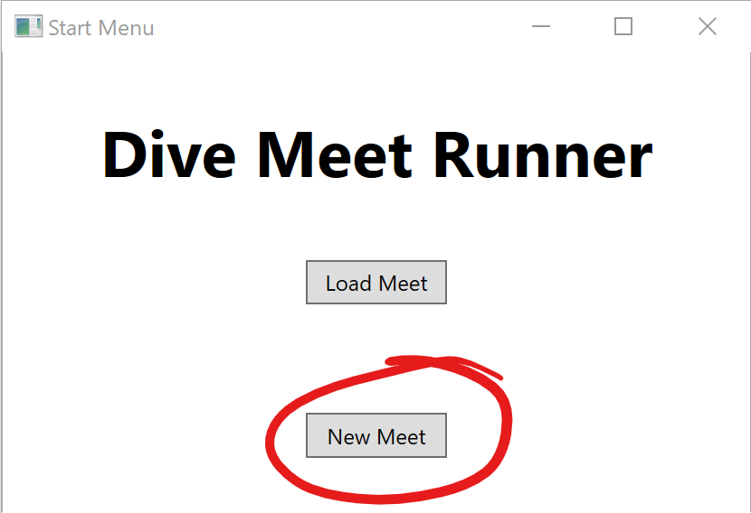

* Create a file name.

  * For my example, I'll call it `ExampleMeet`
* This should be similar to the actual meet name
  
  

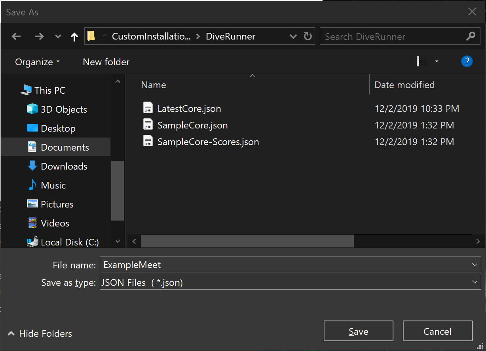

### Event Creation

* Click save and then add a new event

  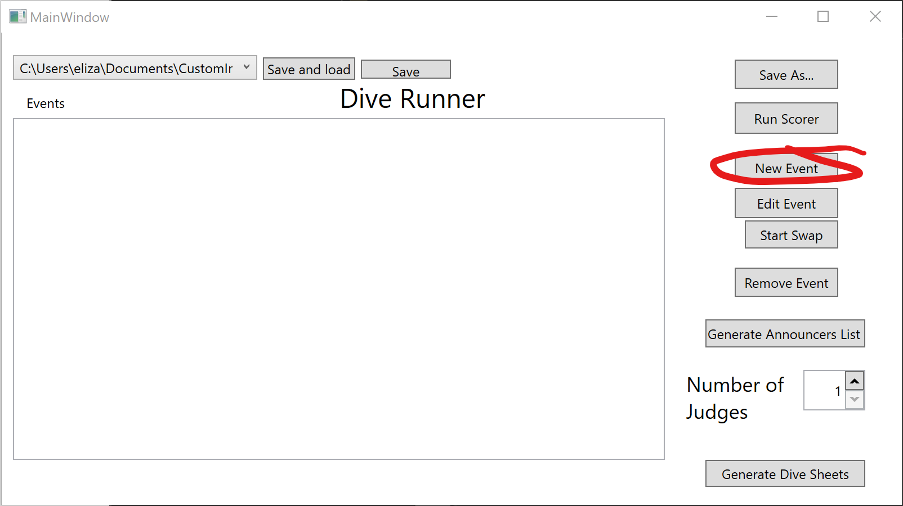

* Give the event a name(1), set the board height(2), then click set(3)

  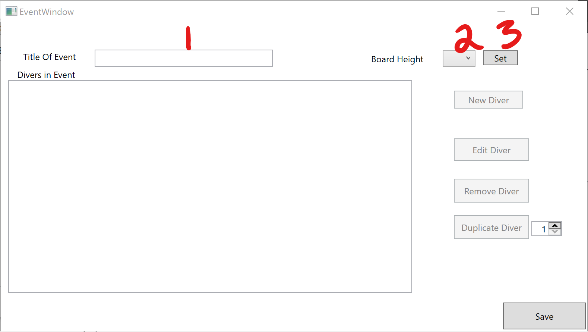

* Create a new diver

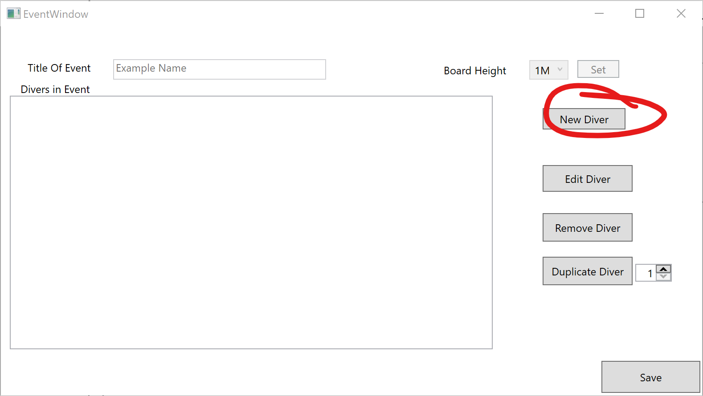

* Give the diver a name(1), then add dive code(100a, 200c, etc) into the add dive box(2), and click add dive(3)

  * Add dives one at a time until all dives have been added

  * **If you don't know a dive code, you can click on `Look up Dive Code`**(4)

    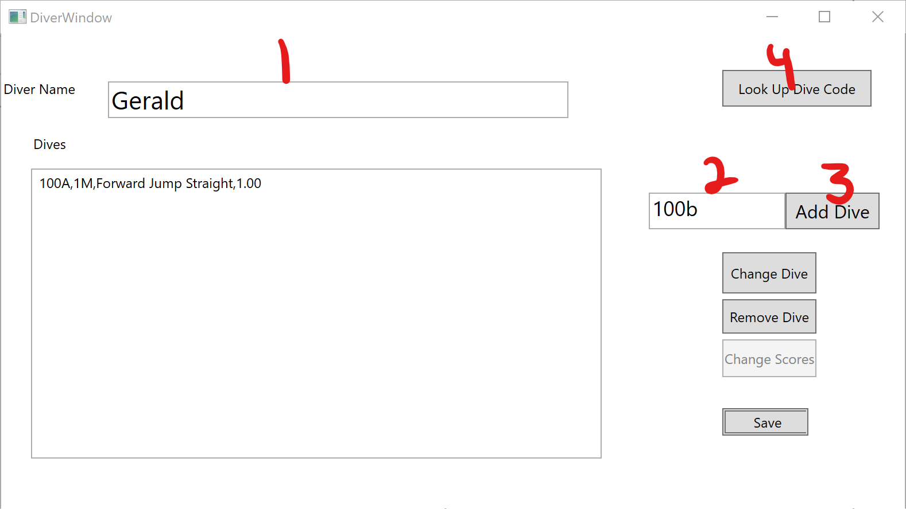

* Press `Save` when finished
* You can add divers continuously like this, however, **all divers in one event must have the same amount of dives**
  
  * If divers have different number of dives, create a new event for the different divers.

#### Duplicating Divers

* When running a meet, it is common to have divers with identical, or almost identical, dive lists. You can use the duplicate divers button to create copies of the selected diver.
* Set the number of divers to create by using the combo box(1), then press `Duplicate Diver`(2)
* Press `Edit Diver`(3) on the duplicate divers to change the names, and make changes to dives if they had small changes.

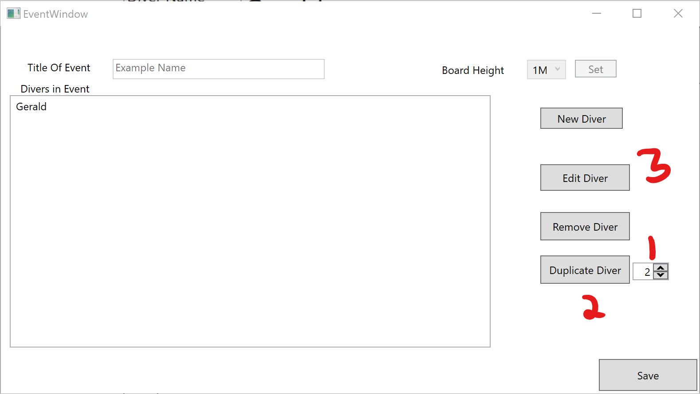

#### Saving Events and adding more events

*  Click `Save`, and the event will be saved.
* You can add events exactly the same way as described above, starting with clicking `New Event`(1).
* You can edit an event(to add divers, make dive changes, etc.) by clicking `Edit Event`(2)
* The order of events are the same as what you see in the box. This also applies to diver orders inside events.
* **To swap the order of the events**, first select the first event to swap, then click `Start Swap`(3), then click the second event, and click the same button again, and the events will switch places.

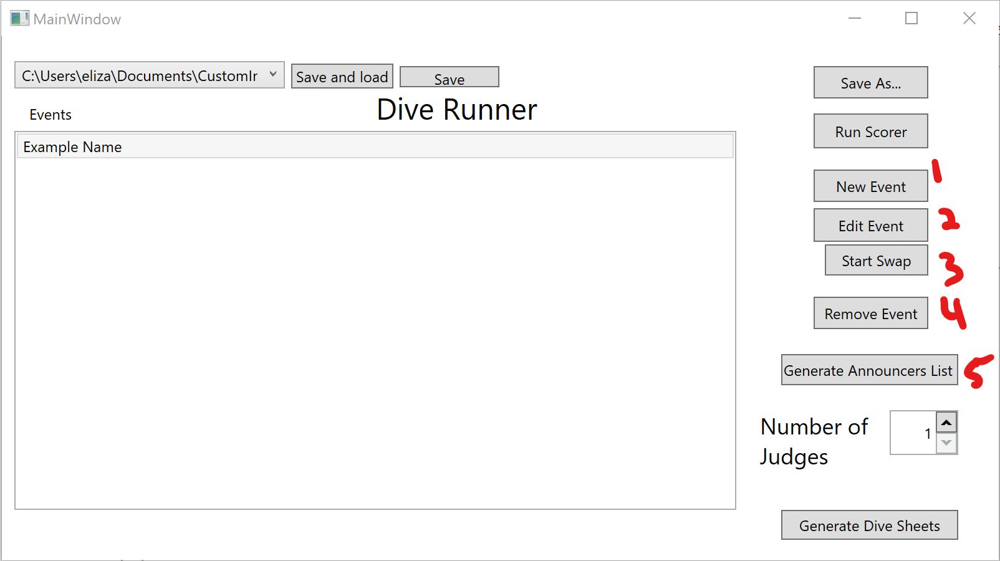

#### Generate Reports

* You can only click `Generate Announcers List`(5) at this stage.
  * This will create an announcers list that can be used for the announcer, as well as showing the diver order, and for people to check off their dives.
  * Clicking the button will open multiple CMD windows. Wait for all to close, then press okay on the message box
  * Repeat one more time, and the PDF should display.

## Scoring the Meet

* After all the events have been added, you can finally start the meet. 

* Click the `Save` button before moving on.

* <u>**The very first thing is to set the number of judges**</u>

  * To do this set the number of judges in the combo box(1)

* Then press `Run Scorer`(2)

  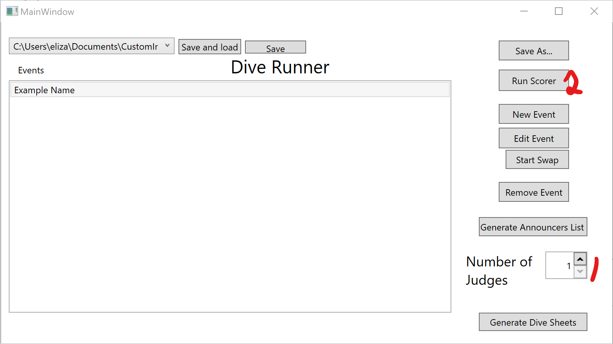

* Input judge scores into the boxes(1), then press `Next Diver`(2)
  * After you click the button, it should be disabled for 3 seconds. This prevents accidentally clicking the button twice
* The diver will change, then you can repeat the process again.

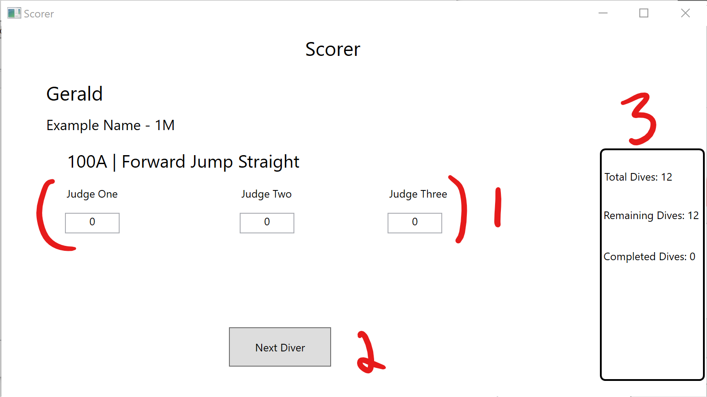

## Finalize Meet

* After meet is finished, click the `Save` button.

* You can now click `Generate Dive Sheets`(1).

  * This follows the same procedure as `Generate Announcers List`

  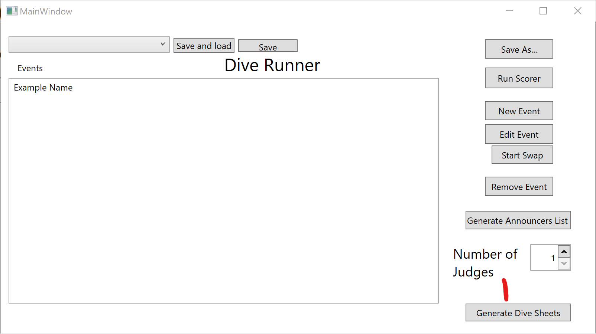

## Problems that you may encounter

* The program is not very stable, so the order has to be very precise.
* If the program crashes, you can still recover the latest core by using the `LatestCore.json`
  * It saves after almost every change, so you have a good chance at recovering your data.
* I would save the core(by pressing the `Save` button) every time you make a change, just to be safe.

## Tips

### Make separate meets for the different board heights

- Since every event in a meet will be run, you can't have 1m and 3m events in the same meet

  - I would create a meet called `MeetName-1m` and another meet called `MeetName-3m`

- To keep track of both files, create the 1m meet as usual, then use the dropdown menu(1), select `Add new file`, then press `Save and load`(2)

  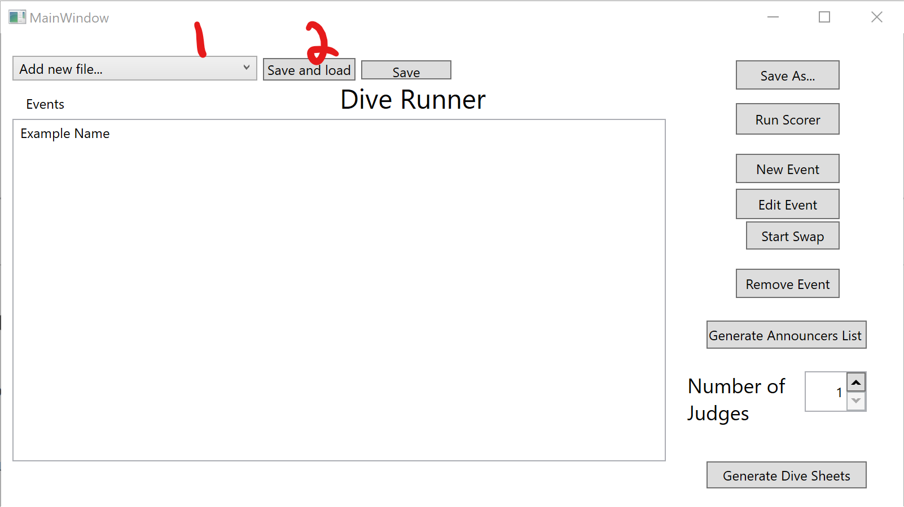

- This will open up a file dialog, and then you can create the new meet the same way.
- You can use the dropdown menu again and select the file you need to work with. 
  - Press `Save and load` to load the different file.